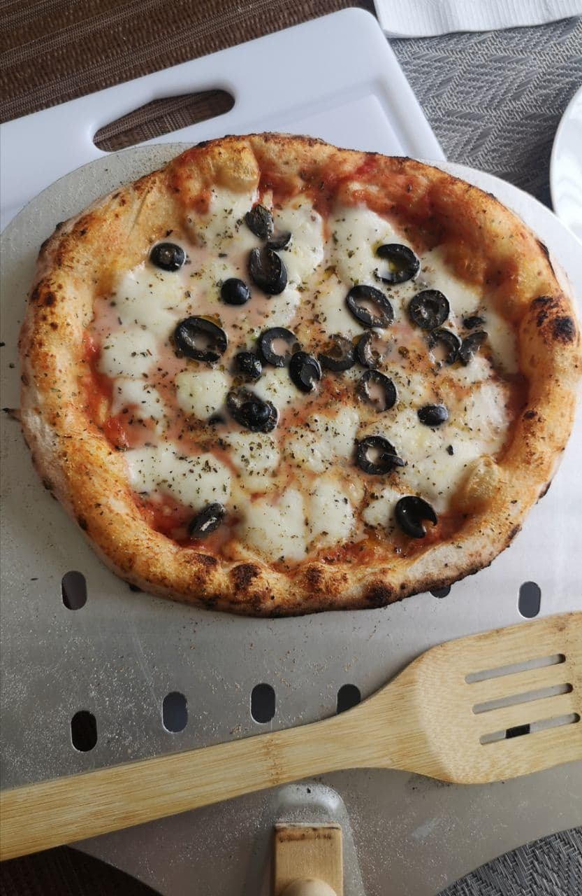
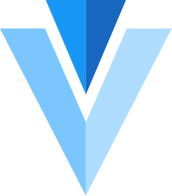

### Hi 👋, I'm Rodrigo

I'm a software engineer, cybersecurity consultant and networking expert (also a pizzaiolo wannabe🤩).

## Skills

### 👨‍💻Software development

    
    
    

    
     
    
     

### 🚀 DevOps

    
    

### 🚨 Cybersecurity
- Ethical Hacking
- Security Assesments
-  🏆 Bug bounty
   - Fintual.com (YC18)
   - Buda.com (largest cryptocurrency exchange in latin america)
   - Bsale.cl (important chilean electronic tax document issuer)

### 🌐 Networking
- Networking Strategy
- Small and medium ISP capacity planning
- Traffic engineering (packet shaping, QoS, eBGP)
- IPTV stuff (EPG implementation, MPEG-TS encapsulation, multicast distribution)
- IPv6 deployment from backbone to customer edge (FTTx)
- DDoS mitigation
- Anycast, tunneling and weird networking stuff

<!--
**rodrigopv/rodrigopv** is a ✨ _special_ ✨ repository because its `README.md` (this file) appears on your GitHub profile.

Here are some ideas to get you started:

- 🔭 I’m currently working on ...
- 🌱 I’m currently learning ...
- 👯 I’m looking to collaborate on ...
- 🤔 I’m looking for help with ...
- 💬 Ask me about ...
- 📫 How to reach me: ...
- 😄 Pronouns: ...
- ⚡ Fun fact: ...
-->
